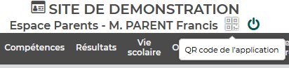

# Pronote2Calendar

**Pronote2Calendar** exports your **Pronote** timetable to **Google Calendar** so you can easily access it and integrate it with other applications.

## Features

- **Sync your Pronote timetable**: Export your Pronote school timetable to a Google Calendar.
- **Supports Pronote accounts**: Works with both **parent** and **child** accounts.
- **Configurable sync period**: Specify the number of days (from today) to sync.
- **Automated & Ephemeral**: Designed to run, sync, and stop. Best suited for running on a schedule (e.g., via cron).

## Prerequisites

To use **Pronote2Calendar**, you will need the following:

- A **Pronote account** (parent or child).
- A **Google Service account** with calendar access.

### Pronote account

To interact with your Pronote account, you need to set up credentials. Use the `init` command provided in the Docker image to generate the necessary configuration file.

Using the QR code login method (recommended):

1. Log in to your Pronote account.
2. Generate the QR code. Note the PIN you entered.

    

3. Read the QR code with any QR code reader app. You should get a JSON object like this:

    ```json
    {"avecPageConnexion":false,"jeton":"13895...AAB","login":"477...65","url":"https://<school_id>.index-education.net/pronote/..."}
    ```

4. Run the `init` command from the Docker image to generate credentials:

    ```bash
    docker run --rm -it ghcr.io/dchaib/pronote2calendar:latest init --qr_code '<your QR code>' --pin <your PIN>
    ```

5. Copy the credentials from the output to a file named `credentials-pronote.json`. Example structure:

    ```json
    {
        "pronote_url": "https://<school_id>.index-education.net/pronote/...",
        "username": "xxxxxxxxxx",
        "password": "627AE53B...",
        "client_identifier": "45A64E1...",
        "uuid": "0cb7f2459..."
    }
    ```

You can also use your username and password (if you have one). Simply run the `init` command without arguments and follow the instructions:
```bash
docker run --rm -it ghcr.io/dchaib/pronote2calendar:latest init
```

### Google service account

To modify your Google Calendar, you need a Google service account and a service account key (JSON).

1. Create a Google Cloud project (if you don't have one): https://developers.google.com/workspace/guides/create-project
2. Enable the Google Calendar API: https://console.cloud.google.com/apis/library/calendar-json.googleapis.com
3. Create a service account: https://developers.google.com/workspace/guides/create-credentials#create_a_service_account
4. Create and download a service account key in JSON format: https://developers.google.com/workspace/guides/create-credentials#create_credentials_for_a_service_account
5. Save the downloaded JSON as `credentials-google.json`.
6. Share the Google Calendar you want to use with the service account and grant the permission "Make changes to events".


## Setup

### 1. Configuration File (`config.yaml`)

Create a `config.yaml` file in the root of your project directory. Here's an example with a `child` account:

```yaml
pronote:
  connection_type: token
  account_type: child
google_calendar:
  calendar_id: "xxx@gmail.com"
sync:
  weeks: 3
```

Here is an example with a `parent` account:
```yaml
pronote:
  connection_type: token
  account_type: parent
  child: <child_name>
google_calendar:
  calendar_id: "xxx@gmail.com"
sync:
  weeks: 3
```

* **pronote**
  - **connection_type**: Defines how you connect to Pronote. There are 2 options, depending on what you used to generate the credentials:
    - `token` if you used the QR code,
    - `password` if you used your username and password.

    This is optional, the default value is `token`.
  - **account_type**: Can be either `parent` or `child` depending on the account you used. This is optional, the default value is `child`.
  - **child**: Only needed if using a `parent` account; specify the name of your child as shown in Pronote.
* **google_calendar**
  - **calendar_id**: The **ID** of your Google Calendar (can be found in Google Calendar settings).
* **sync**
  - **weeks**: The number of weeks (including the current one) to sync. Example: If set to `3`, it will sync the current week and the next 2 weeks. This parameter is optional. If not specified, the default value is `3`. The minimum is `1`.

#### Optional: Time Adjustments

You can adjust lesson times for specific weekdays and time slots. This is useful if Pronote displays different times than the actual class times. Use the `time_adjustments` field:

```yaml
pronote: { ... }
google_calendar: { ... }
sync: { ... }
adjustments:
  time:
    - weekdays: [ 1, 2, 4, 5 ]
      start_times:
        "08:00": "08:05"
        "09:00": "09:05"
      end_times:
        "14:40": "14:45"
    - weekdays: [ 3 ]
      start_times:
        "9:00": "8:55"
```

* **adjustments.time**: An array of adjustment rules. Each rule applies to specific weekdays and adjusts lesson times. This parameter is optional; if not specified, no time adjustments are applied.
  - **weekdays**: An array of weekday numbers (ISO format: 1=Monday, 2=Tuesday, ..., 7=Sunday) to which this rule applies.
  - **start_times**: A mapping of original start times (in `HH:MM` format) to adjusted start times. Only lessons matching the original time will be adjusted.
  - **end_times**: A mapping of original end times (in `HH:MM` format) to adjusted end times. Only lessons matching the original time will be adjusted.

For example, the first rule above adjusts all lessons on Monday, Tuesday, Thursday, and Friday (weekdays 1, 2, 4, 5) that start at 08:00 to start at 8:05 instead. The second rule adjusts Wednesday lessons (weekday 3) that start at 09:00 to start at 8:55.

#### Optional: Subject Adjustments

You can adjust lesson subject names to display more user-friendly versions. This is useful if Pronote displays long or technical subject names that you prefer to shorten. Use the `subject` field under `adjustments`:

```yaml
pronote: { ... }
google_calendar: { ... }
sync: { ... }
adjustments:
  subject:
    "Sciences de la Vie et de la Terre": "SVT"
    "Histoire-Géographie": "Histoire-Géo"
    "Éducation musicale": "Musique"
    "Éducation physique et sportive": "EPS"
```

* **adjustments.subject**: A mapping of original subject names to adjusted subject names. This parameter is optional; if not specified, no subject adjustments are applied.
  - Each key is the original subject name as displayed in Pronote.
  - Each value is the adjusted subject name that will be displayed in Google Calendar.

For example, the mapping above will replace "Sciences de la Vie et de la Terre" with "SVT" for all lessons with that subject. Any subject not in the mapping will remain unchanged.

#### Optional: Event Templates

You can customize how lesson events appear in Google Calendar by defining templates for the event summary, description, and location. This uses [Jinja2 templating](https://jinja.palletsprojects.com/) to dynamically generate event properties based on lesson data. Use the `templates` field under `events`:

```yaml
pronote: { ... }
google_calendar: { ... }
sync: { ... }
adjustments: { ... }
events:
  templates:
    summary: "{{ subject }}"
    description: "{{ teacher_name }}"
    location: "{{ classroom }}"
```

##### Customizable Properties

The following properties can be customized:

* **summary**: The title of the calendar event. Default: `"{{ subject }}"`
* **description**: The description of the event. **Supports HTML formatting** for rich text. Default: `"{{ teacher_name }}"`
* **location**: The location field of the event. Default: `"{{ classroom }}"`

All three properties are optional. If not specified, the default values shown above are used.

##### Available Variables

You can use any of the following variables in your templates:

* **Lesson Details**
  - `start` - Starting time of the lesson (datetime)
  - `end` - Ending time of the lesson (datetime)
  - `subject` - Subject name (string, empty if not available)
  - `in_groups` - Whether the subject is in groups (boolean)
  - `memo` - Lesson memo/notes (string, empty if not available)
  - `status` - Status of the lesson (string, empty if not available)
  - `background_color` - Background color of the lesson (string, empty if not available)

* **Teacher Information**
  - `teacher_name` - Name of the teacher (string, empty if not available)
  - `teacher_names` - List of teacher names (list of strings, empty if not available)

* **Location Information**
  - `classroom` - Name of the classroom (string, empty if not available)
  - `classrooms` - List of classroom names (list of strings, empty if not available)
  - `virtual_classrooms` - List of URLs for virtual classrooms (list of strings)

* **Group Information**
  - `group_name` - Name of the group (string, empty if not available)
  - `group_names` - List of group names (list of strings, empty if not available)

* **Lesson Status Flags**
  - `canceled` - Whether the lesson is canceled (boolean)
  - `outing` - Whether it is a pedagogical outing (boolean)
  - `exempted` - Whether the student is presence is exempt (boolean)
  - `detention` - Whether it is marked as detention (boolean)
  - `test` - Whether there will be a test in the lesson (boolean)
  - `normal` - Whether the lesson is considered normal (not detention or outing) (boolean)

##### Examples

Here are some practical examples of template customization:

```yaml
events:
  templates:
    # Include subject and teacher
    summary: "{{ subject }} - {{ teacher_name }}"
    
    # Include both classroom and group information
    description: "Room: {{ classroom }}\nGroup: {{ group_name }}"
    
    # Use HTML formatting for rich text
    description: "<b>{{ subject }}</b><br>Teacher: {{ teacher_name }}<br>Room: {{ classroom }}"
    
    # Show time details
    summary: "[{{ start.strftime('%H:%M') }}] {{ subject }}"
    
    # Conditional example (using Jinja2 filters)
    description: "Teacher: {{ teacher_name }}"
```

### 2. Create your Docker Compose file

You can use **Docker Compose** to run the container. Here is an example:

```yaml
services:
  pronote2calendar:
    image: "ghcr.io/dchaib/pronote2calendar:latest"
    volumes:
      - "./config.yaml:/app/config.yaml:ro"
      - "./credentials-google.json:/app/credentials-google.json:ro"
      - "./credentials-pronote.json:/app/credentials-pronote.json:rw"
```

If you are using the QR code login method, the Pronote credentials file needs write permissions (`rw`) because the password is updated after each login. Otherwise, you can keep it read-only (`ro`).

To keep the example simple, it uses the `latest` tag. For reproducibility, you should pin a specific tagged image in production.

It also assumes that all the configuration files (`config.yaml`, `credentials-google.json`, and `credentials-pronote.json`) are in the same directory as your compose file.


## Running the App

After setting everything up, you can run the container using Docker Compose. Since the container is ephemeral, it will run, sync your calendar, and then stop automatically.

If all goes well, you should see the logs similar to those:
```
2025-10-25T18:31:51+0200 INFO pronote2calendar: Updating lessons from 2025-10-25T00:00:00+02:00 to 2025-11-14T00:00:00+02:00
2025-10-25T18:31:51+0200 INFO pronote2calendar: Initializing Pronote client
2025-10-25T18:31:51+0200 INFO pronotepy.pronoteAPI: INIT
2025-10-25T18:31:51+0200 INFO pronotepy.pronoteAPI: successfully logged in as xxxxxxxxxx
2025-10-25T18:31:51+0200 INFO pronotepy.pronoteAPI: got onglets data.
2025-10-25T18:31:51+0200 INFO pronote2calendar: Fetching lessons from Pronote
2025-10-25T18:31:51+0200 INFO pronote2calendar: Fetched 38 lessons
2025-10-25T18:31:51+0200 INFO pronote2calendar: Initializing Google Calendar client
2025-10-25T18:31:51+0200 INFO googleapiclient.discovery_cache: file_cache is only supported with oauth2client<4.0.0
2025-10-25T18:31:51+0200 INFO pronote2calendar: Fetching events from Google Calendar
2025-10-25T18:31:52+0200 INFO pronote2calendar: Fetched 30 existing events
2025-10-25T18:31:52+0200 INFO pronote2calendar: Detecting changes between lessons and calendar events
2025-10-25T18:31:52+0200 INFO pronote2calendar: Change detection produced add=8 remove=0 update=0
2025-10-25T18:31:52+0200 INFO pronote2calendar: Applying changes to calendar
2025-10-25T18:32:08+0200 INFO pronote2calendar: Finished applying changes
```

### Recommended: Schedule Regular Syncs

If you want to sync regularly (and you most likely do), it is best to run it on a schedule (e.g., using `cron`) to sync your timetable at regular intervals, without overwhelming the Pronote servers. For example, running it daily would be a good starting point:

```bash
0 0 * * * cd /path/to/compose/file && docker compose up -d
```

This would run the synchronization at midnight every day.


## Troubleshooting

### Common Issues

* **Pronote Login Issues**: If you're unable to log in, ensure that your `credentials-pronote.json` file is properly generated by running the `init` command. If you used the QR code, the file needs write permissions for the app to update the password after each login.
* **Google Calendar Permissions**: Make sure your Google Service account has proper permissions to make changes to events.

## Contributing

Feel free to ask questions, submit issues and propose improvements. Contributions are welcome!

## License

This project is licensed under the MIT License - see the [LICENSE](LICENSE) file for details.
